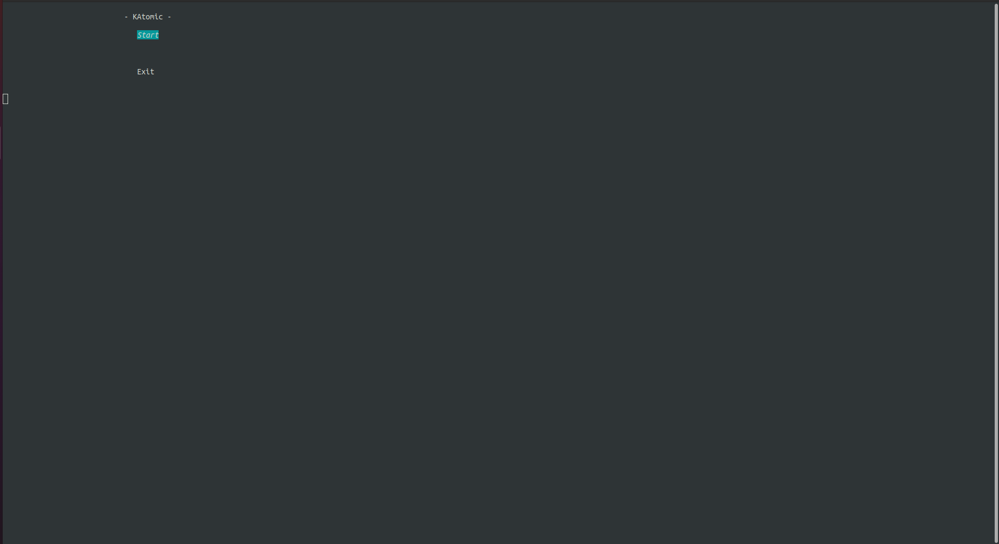
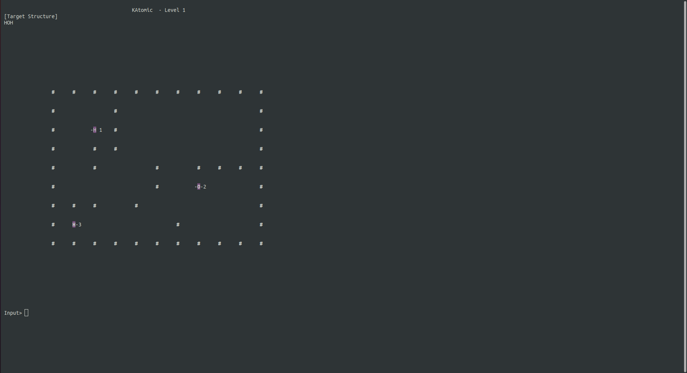

# katomic
KAtomic game in  C++.

# How To Run
Insall Requirements:
```
sudo apt-get update
sudo apt-get install build-essential manpages-dev
```

Then run:
```
chmod +x ./run
./run
```

# How to play
This section describes how to play. Before anything please maximize (full screen)
the terminal window to make the game playable. The first screen is the Menu screen.
Enter 'e' and press Enter to start the game.



The game's objective is to form the molecule that is desribed at the top of the screen.
There exists four directions to move:
```
w -> Up
s -> Down
a -> Left
d -> Right
```
Enter a direction and then press Enter. The selected atom (The atom that is blinking) 
will move till the next stop at its way. To switch between atoms enter the index (number) 
assinged to that atom that is displayed next to it and then press Enter.


Enjoy!
